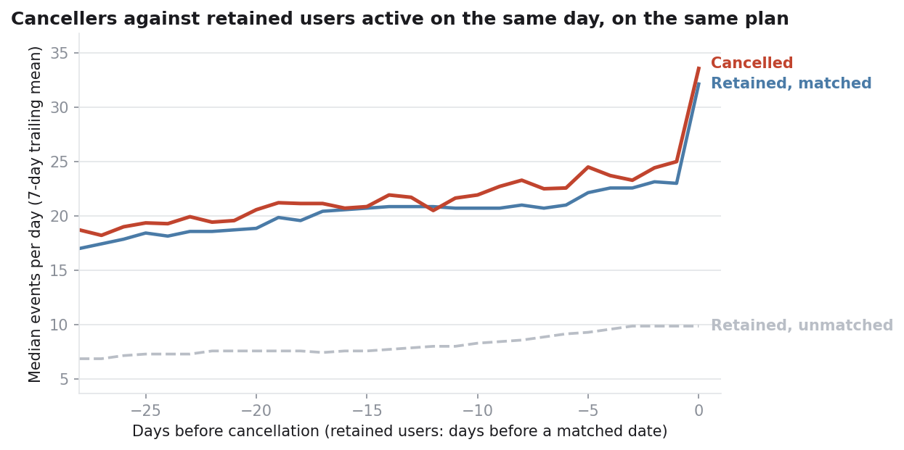
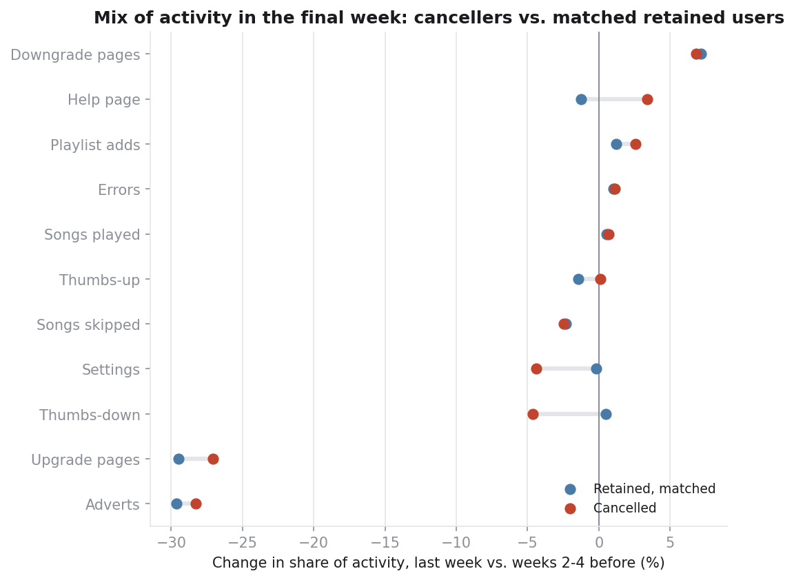
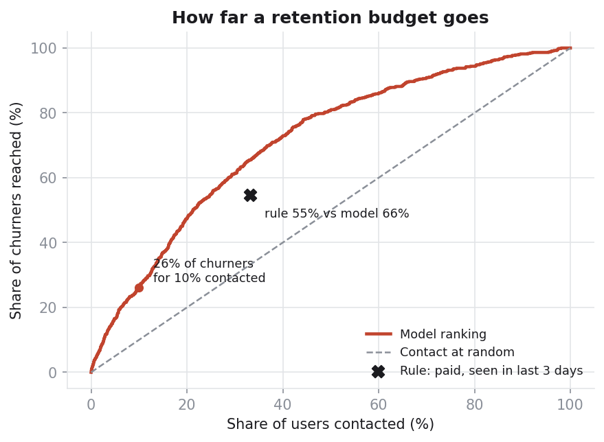

# Subscriber Churn: What Precedes a Cancellation, and Where to Intervene

A behavioural analysis of subscriber churn on a music-streaming service, based on
51 days of event logs covering 19,140 users.

## Executive summary

**Initial hypothesis.** Churn is commonly assumed to be gradual: users disengage
over several weeks, and cancellation marks the end of that decline.

**Finding.** The data does not support this hypothesis. A first comparison
appeared to show the reverse, with cancellers more active than retained users and
increasingly so ahead of cancelling. That result was an artefact of the
comparison. When cancellers are compared with retained users on the same plan who
were active on the same day, their behaviour is indistinguishable up to the
moment of cancellation: similar listening volume, skip rates, error rates and
negative feedback.

**Interpretation.** Cancellation behaves as a decision taken during an otherwise
ordinary visit, not as the outcome of declining engagement. Heavier users cancel
more often mainly because they visit more often; on a per-visit basis, they are
less likely to cancel.

**Recommendation.** Shift retention effort from early-warning prediction to the
point of decision: test a save offer within the downgrade and cancellation flow,
measured against a randomised control group.

> Full results are in **[findings.md](findings.md)**, regenerated from the data by
> `run_analysis.py`. No figure in that file is entered manually.

---

## Attribution

The underlying modelling was developed with a teammate for the 2025/26 Kaggle
churn prediction competition, **which our team won**; that work is held in a
separate repository. The behavioural analysis, framing, intervention economics and
findings in this repository are my own.

---

## 1. Business problem

A subscription business can grow revenue by acquiring subscribers or by retaining
existing ones. Retention is usually the less expensive lever, provided three
questions can be answered:

1. **Is churn predictable,** or is it effectively random until the moment of
   cancellation?
2. **If it is predictable, which signals predict it, and how far in advance?** A
   signal that appears only the day before cancellation leaves no time to act.
3. **Where should retention effort be focused?** Contacting every user costs more
   than it recovers.

The competition addressed only a narrow form of the first question: maximising
balanced accuracy on a held-out set. This analysis addresses all three from a
business perspective.

## 2. Data and constraints

The dataset contains 51 days of event logs (1 October to 20 November 2018), with
one row per user interaction: page viewed, timestamp, subscription tier, session,
track metadata, device, location and account registration date. A user is
classified as churned on reaching the `Cancellation Confirmation` page.

**Constraint 1: the prediction window lies outside the data.** The competition
brief defined churn as cancellation in the 10 days after 20 November 2018, but
the released logs end on that date. Two labelling options were available:

| Option | Definition | Trade-off |
|---|---|---|
| Ever cancelled | Cancelled at any point in the observed window | Usable immediately, but training and test sets define the target differently |
| Cancelled after an anchor date | Cancelled within N days of a date inside the window | Matches the business question, but reduces usable data |

The competition submission used the first option, consistent with the released
data and the leaderboard. **This analysis uses the second**: all features are
computed over a look-back period ending at an anchor date, and the label records
cancellation strictly after that date.

**Constraint 2: activity before 1 October is not observed.** A user's first
logged event marks the start of the log, not the start of the subscription.
Tenure is therefore measured from the registration date, and the analysis of
pre-cancellation behaviour includes only users whose full look-back period falls
within the observation window and after registration. This retains 1,108 of
4,271 cancellers. The selection depends on when in the window a user cancelled,
not on how long they had been a member.

## 3. Methodology

**a. Matched comparison of pre-cancellation activity.** Comparing cancellers with
retained users on arbitrary dates conflates cancellation with three other effects:

- **Seasonality:** activity changes over the observation period for all users.
- **Subscription tier:** cancellers are more often paid subscribers, and paid
  subscribers listen more.
- **Presence:** a cancellation requires a visit, whereas a randomly selected date
  for a retained user is frequently a day with no activity.

Each canceller is therefore compared with retained users **on the same plan who
had a session on the same calendar day**. Day 0 is the day the cancellation
session began, so sessions spanning midnight are aligned consistently across
groups. The unmatched comparison is reported alongside, to quantify how much of
the apparent difference it introduces.

**b. Decomposition of activity.** For each activity type (songs, skips, adverts,
positive and negative feedback, errors, help, settings, downgrade and upgrade
pages, playlist additions), its share of total events is compared between weeks
two to four before the anchor and the final week. The final week excludes day 0,
which contains the cancellation flow itself.

**c. Normalisation by exposure.** Cancellations per 100 sessions are compared
across visit-frequency quintiles within each tier, to distinguish a higher risk
per visit from a higher number of visits.

**d. Signal strength.** For each signal, the cancellation rate in its most
extreme quintile is compared with the overall rate (lift), testing both high and
low extremes. Signals that vary by tier are also assessed within each tier, as
pooling can mask or reverse an effect.

**e. From risk ranking to budget.** A cross-validated gradient-boosted model
ranks users by cancellation risk. The ranking is translated into a gains curve
and a net-value curve, and benchmarked against a single-condition business rule,
so that the model is credited only with its incremental value.

## 4. Findings

### 4.1 The apparent pre-cancellation spike is an artefact of the comparison

The initial hypothesis was a gradual decline in engagement. The first
comparison, which aligned cancellers on their cancellation date and set them
against retained users on random dates, suggested the opposite: cancellers
appeared nearly three times as active, with activity rising through the final
month and peaking in the last days.

Three explanations were tested:

| Explanation | Test | Result |
|---|---|---|
| **Seasonality:** activity increases for all users over the period | Retained users observed over the same dates | Their activity also rises (+9% in the final week) |
| **Tier:** cancellers are more often paid subscribers | Match on tier | Explains part of the difference in activity level |
| **Presence:** cancelling requires a visit | Match on activity on the same day | Explains the remaining difference |

Once cancellers are matched on date, plan and same-day activity, the difference
disappears:

| Group | Events per day, weeks 2–4 before | Final week | Change |
|---|---|---|---|
| Cancelled | 36.6 | 39.2 | +7% |
| Retained, matched | 35.8 | 38.3 | +7% |
| Retained, unmatched | 20.8 | 22.7 | +9% |

On day 0, median activity rises to 33.6 events for cancellers and 32.1 for
matched retained users. The spike is characteristic of any day with a visit, not
of cancellation.



### 4.2 The user experience does not deteriorate before cancellation

The composition of activity in the final week is the same for cancellers and
matched retained users. Skips move from 12.5 to 12.2 per 100 events (matched
users: 12.6 to 12.3); errors remain at 0.10; negative feedback moves from 1.02 to
0.97; downgrade-page visits move from 0.83 to 0.89 (matched users: 0.74 to 0.79).
The share of adverts falls by approximately 30% in both groups. No activity type
indicates a deterioration in experience ahead of cancellation.



### 4.3 Heavier users cancel more because they visit more often

Among paid subscribers, the most frequent visitors log 12 times as many sessions
as the least frequent and cancel 5.5 times as often. Per visit, their
cancellation rate is therefore less than half that of the least active group.
Each visit carries some probability of cancellation; highly engaged users
accumulate more visits, even though each visit carries a lower risk.

### 4.4 Remaining signals

- **Downgrade-page visits** (1.6× lift) and **negative feedback** (1.3×) indicate
  intent and dissatisfaction, although their effect is modest once visit
  frequency is taken into account.
- **Advert exposure predicts cancellation within each tier:** 1.27× for free
  users and 1.35× for paid users, but 0.81× when tiers are pooled. Because paid
  subscribers see few adverts yet cancel more often, pooling makes a genuine
  signal appear protective.
- **Tenure is not predictive.** Measured from registration, the median canceller
  had been a member for 51 days, and the cancellation rate is stable at 4.3–4.4%
  for users with four weeks to six months of tenure, who make up 97% of the
  panel.
- **One third of cancellations come from free-tier accounts,** so churn is not
  confined to paid subscriptions.

### 4.5 A model adds limited value over a simple rule

Contacting the 10% of users with the highest model score reaches 26% of future
cancellers. However, a single rule (paid subscriber, active in the last three
days) flags 33% of users and captures 55% of cancellers. At the same contact
volume, the model captures 66%: an incremental gain of 11 percentage points.



## 5. Business implications

Cancellation in this data is best understood as a decision point rather than a
symptom. Users do not signal it through a deteriorating experience: until they
cancel, they use the product in the same way as users who stay. The factors that
drive the decision are not captured in these logs; likely candidates include
price relative to perceived value, billing dates, competing offers and changes in
personal circumstances. This profile is consistent with value-driven churn rather
than churn caused by product failure.

This has three implications:

1. **Engagement-decline alerts would be ineffective.** There is no decline to
   detect.
2. **Activity-based outbound campaigns would mainly reach frequent visitors,**
   who are the least likely to cancel on any given visit. A risk score built on
   activity largely predicts who will use the app soon.
3. **The cancellation path is the most reliable point of intervention.** 42% of
   cancellations are initiated from the downgrade page. A save offer at this step
   (a pause, a lower-priced plan, a discount, or a summary of what the user would
   lose) reaches users at the moment of decision and can be tested at low cost.

## 6. Limitations

- **Only explicit cancellations are captured.** Users who stop using the service
  without cancelling are classified as retained. Silent churn is not observable
  in this data and may account for a larger share of lost users in a real
  business.
- **The data is likely simulated.** The schema matches Udacity's public
  "Sparkify" dataset, which was produced by an event simulator, and the data is
  consistent with this: 30% of cancellations are reached directly from an advert
  and 11% from a negative-feedback action, which are not navigation paths a real
  application would offer. A cancellation risk attached to each visit, with no
  prior change in behaviour, is also what a page-transition simulator produces.
  The specific results may therefore partly reflect how the data was generated.
  **The methodology is what transfers to real data**: matched controls, activity
  decomposition, exposure normalisation and benchmarking against a simple rule.
- **The analysis is observational.** All recommendations are hypotheses to be
  validated experimentally.
- **Matching covers date, plan and same-day activity only.** Control users are
  sampled with replacement (5,540 draws from 4,195 users), and a small residual
  difference in median activity remains (18.7 versus 17.0 events per day, four
  weeks before the anchor).
- **The pre-cancellation analysis covers approximately a quarter of
  cancellers,** namely those whose full look-back period is observed.
- **The save rate is an assumption.** It determines the net-value curve and can
  only be established experimentally.
- **The analysis covers 51 days and a single anchor date,** so seasonal effects
  and stability across anchor dates are untested.
- **Contacting users is assumed to carry no cost beyond the contact itself.** In
  practice, a poorly targeted retention message may prompt a hesitant user to
  cancel.

## 7. Recommended next steps

1. **Test an intervention at the point of decision.** Introduce a save offer
   (pause, lower-priced plan or discount) in the downgrade and cancellation flow,
   evaluated against a randomised control group. The experiment also provides the
   save rate required for the budget analysis.
2. **Deprioritise engagement-decline alerts,** as the data shows no decline to
   detect.
3. **Benchmark any outbound targeting model against the simple rule,** and invest
   in proportion to its 11-point incremental gain.
4. **Test advert frequency for free users,** the one experience-related factor
   that predicts cancellation within tier.
5. **Collect the data the logs do not contain:** billing dates, plan pricing and
   cancellation reasons.
6. **Introduce a behavioural churn definition** (for example, no activity for a
   set number of days) alongside explicit cancellation, and repeat the analysis.
7. **Monitor cancellations per 1,000 sessions** alongside overall churn, so that
   growth in usage is not mistaken for an increase in risk.

---

## Reproducing the analysis

```bash
pip install -r requirements.txt
# Place train.parquet in data/ (see data/README.md)
python run_analysis.py --data data/train.parquet
```

The script produces five charts in `figures/` and regenerates `findings.md` in
approximately 30 seconds.

To test the pipeline without the competition data, run the following in a copy
of the repository that does not contain `data/train.parquet`:

```bash
python make_fixture.py && python run_analysis.py --horizon 14
```

The synthetic fixture exists solely to verify that the pipeline runs, and no
finding is derived from it. When fixture data is used, `findings.md` carries a
prominent warning, and `make_fixture.py` will not overwrite an existing
`data/train.parquet`.

```
src/churn_analysis.py   Matched comparison, decomposition, panel, lift, exposure, gains, economics
run_analysis.py         Generates the charts and findings.md
make_fixture.py         Synthetic data for pipeline testing only
findings.md             Generated results
```
