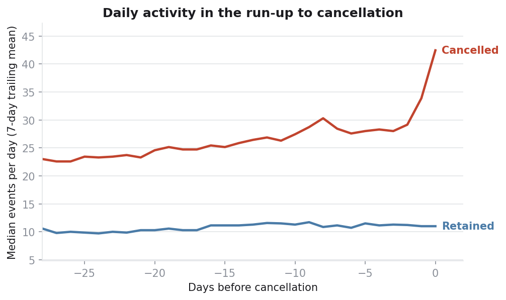
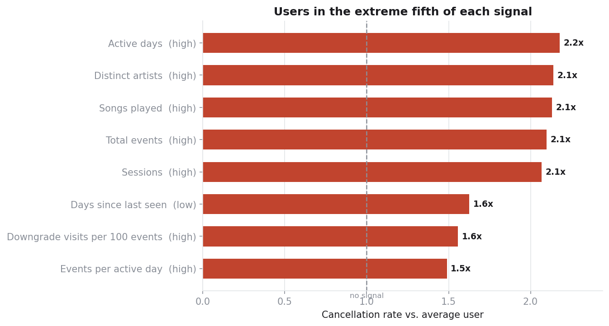
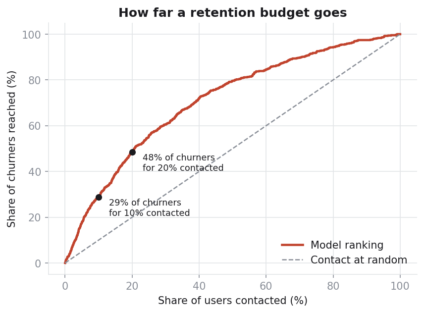
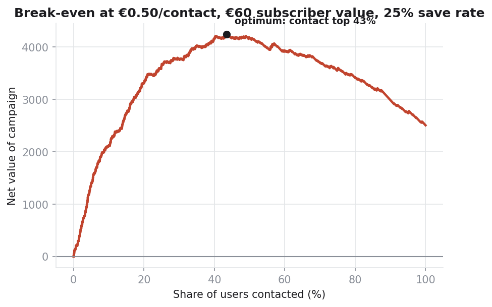

# Findings

_Generated by `run_analysis.py` on 2026-09-12 20:24. Every number below is computed, not typed._

## Setup

- Anchor date: **2018-11-10**
- Features from the 28 days before the anchor; label is cancellation in the 10 days after it.
- Users at risk at the anchor: **14,729**
- Cancelled within the horizon: **658** (4.5%)

## 1. What does the run-up to cancellation look like?

- Median daily activity among users who cancel rises from **23** events/day (4 weeks out) to **34** on the final day.
- Retained users sit flat at **11** events/day over the same period — cancellers run **3.1x** more active than they do on the final day.
- The final day or two is inflated for cancellers by construction: cancelling requires an active session, while a retained user's placebo anchor day need not contain one. Read the last two points as an artefact of the alignment, not as behaviour.
- Restricted to users with a full 28-day history before their anchor: **923** of **4,271** cancellers qualify. Earlier cancellers are excluded because days before a user's first event are not days they were idle.

## 2. What leads cancellation?

| Signal | Kind | Direction | Cancellation rate | Lift |
|---|---|---|---|---|
| Active days | volume | high | 9.7% | **2.2x** |
| Distinct artists | volume | high | 9.6% | **2.1x** |
| Songs played | volume | high | 9.5% | **2.1x** |
| Total events | volume | high | 9.4% | **2.1x** |
| Sessions | volume | high | 9.2% | **2.1x** |
| Days since last seen | decline | low | 7.3% | **1.6x** |
| Downgrade visits per 100 events | behaviour | high | 7.0% | **1.6x** |
| Events per active day | volume | high | 6.7% | **1.5x** |
| Thumbs-down per 100 events | behaviour | high | 6.0% | **1.3x** |
| Errors per 100 events | behaviour | high | 4.6% | **1.0x** |

Strongest single signal: **Active days** (high) — those users cancel at 9.7% against a base rate of 4.5%.

**Volume** signals measure how much a user did over the lookback; **decline** signals measure which way they were heading. A volume signal with high lift says heavier users cancel more, which is a statement about who cancels, not about a run-up to it — and it matches §1, where cancellers are the more active group throughout.

Tested and **not** predictive — every quintile at or below the base rate: Help visits per 100 events (0.84x), Settings visits per 100 events (0.83x), Adverts per 100 events (0.77x), Activity trend (daily slope) (0.72x), Playlist adds per 100 events (0.70x), Thumbs-up per 100 events (0.68x). Advert exposure is the notable one: it is the lever the business most directly controls, and it carries no signal here.

## 3. Who cancels?

- The median canceller has **18.4 days** of history before cancelling. **68%** have under 28 days and **25%** under 7 — cancellation here is concentrated in early life, not in long-tenured decline.
- Paid users cancel at **5.8%** against **2.8%** for free users. Only a paid subscription can be cancelled, so the label follows the tier.
- The heaviest fifth by event volume is **85%** paid against **56%** overall, so the volume lift in §2 is partly a tier effect. Within paid users alone, high volume carries **1.83x** lift — so the effect survives tier.

> Cancellation is only visible here when a user clicks through it. A user who quietly stops listening is counted as retained, which biases every result toward engaged, paying subscribers — read any link between heavy usage and cancellation with that in mind.

## 4. Who is worth contacting?

- Contacting the top **5%** by risk reaches **18%** of everyone who will cancel (precision 16%).
- Contacting the top **10%** by risk reaches **29%** of everyone who will cancel (precision 13%).
- Contacting the top **20%** by risk reaches **48%** of everyone who will cancel (precision 11%).

## 5. What is that worth?

At €0.50 per contact, €60 subscriber value and a 25% save rate, net value peaks when contacting the top **43%** of users.

> The save rate is an assumption, not a measurement — it is the one input here that only an experiment can supply. See the limitations section of the README.
