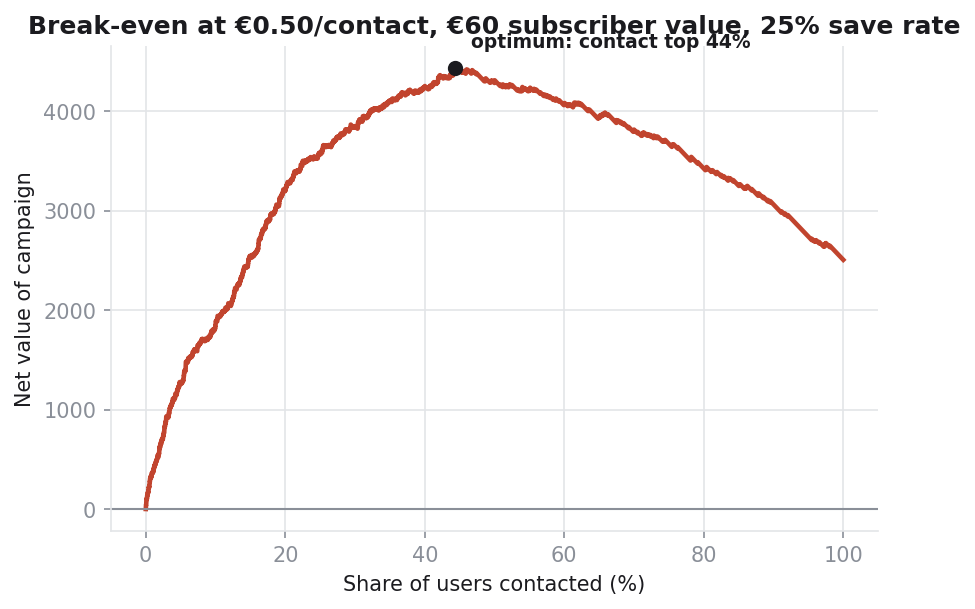

# Findings

_Generated by `run_analysis.py` on 2026-09-12 21:04. Every number below is computed, not typed._

## Setup

- Anchor date for the panel (§3–§7): **2018-11-10**
- Features from the 28 days before the anchor; label is cancellation in the 10 days after it.
- Users at risk at the anchor: **14,729**
- Cancelled within the horizon: **658** (4.5%)

## 1. What happens before a cancellation?

Compared against three groups. **Cancelled**: 1,108 of 4,271 cancellers whose account existed, and whose history was observed, for the full lookback. **Retained, matched**: 5,540 draws of 4,195 never-cancelling users who had a session on the same calendar day, on the same tier, as a canceller. **Retained, unmatched**: 12,591 retained users on a random canceller date, with no other matching — the naive comparison, kept to show how much of the gap it creates.

| Group | Events/day, weeks 2–4 before | Events/day, final week (excl. day 0) | Change |
|---|---|---|---|
| Cancelled | 36.6 | 39.2 | +7% |
| Retained, matched | 35.8 | 38.3 | +7% |
| Retained, unmatched | 20.8 | 22.7 | +9% |

- Four weeks out, the median canceller runs at **18.7** events/day, against **17.0** for matched retained users and **6.9** for unmatched ones (means differ by +2%). Against a fair comparison, cancellers are about as active as users who stay — the 2.7x gap to the unmatched group is the comparison, not the users.
- Over the final week, cancellers' activity changes by **+7%** against **+7%** for matched retained users — no run-up specific to cancellation.
- On day 0 the median jumps to **33.6** for cancellers and **32.1** for matched retained users: the spike is what any day with a visit looks like, not a signature of cancelling.

## 2. Is it errors, skips, adverts?

Share of activity (per 100 events) in weeks 2–4 before, and in the final week excluding day 0 — the cancellation flow itself happens on day 0 and would otherwise show up as behaviour.

| Component | Cancelled | Retained, matched | Gap in change |
|---|---|---|---|
| Songs skipped | 12.52 → 12.21 | 12.60 → 12.31 | -0% |
| Songs played | 82.21 → 82.77 | 82.33 → 82.78 | +0% |
| Adverts | 1.43 → 1.03 | 1.05 → 0.74 | +1% |
| Thumbs-down | 1.02 → 0.97 | 0.89 → 0.89 | -5% |
| Thumbs-up | 4.20 → 4.21 | 4.76 → 4.69 | +2% |
| Errors | 0.10 → 0.10 | 0.10 → 0.10 | +0% |
| Help page | 0.51 → 0.53 | 0.51 → 0.50 | +5% |
| Settings | 0.69 → 0.66 | 0.68 → 0.68 | -4% |
| Downgrade pages | 0.83 → 0.89 | 0.74 → 0.79 | -0% |
| Upgrade pages | 0.22 → 0.16 | 0.20 → 0.14 | +2% |
| Playlist adds | 2.36 → 2.42 | 2.37 → 2.40 | +1% |

No component with meaningful volume moves more than 20 points differently for cancellers than for matched users: the mix of what they do — songs, skips, errors, help, thumbs-down, adverts, downgrade pages — is the same as anyone else's.

## 3. What leads cancellation?

| Signal | Kind | Direction | Cancellation rate | Lift |
|---|---|---|---|---|
| Active days | volume | high | 9.7% | **2.2x** |
| Distinct artists | volume | high | 9.6% | **2.1x** |
| Songs played | volume | high | 9.5% | **2.1x** |
| Total events | volume | high | 9.4% | **2.1x** |
| Sessions | volume | high | 9.2% | **2.1x** |
| Days since last seen | recency | low | 7.3% | **1.6x** |
| Downgrade visits per 100 events | behaviour | high | 7.0% | **1.6x** |
| Events per active day | volume | high | 6.7% | **1.5x** |
| Thumbs-down per 100 events | behaviour | high | 6.0% | **1.3x** |
| Errors per 100 events | behaviour | high | 4.6% | **1.0x** |

Tested with no quintile above the base rate: Help visits per 100 events (0.84x), Settings visits per 100 events (0.83x), Adverts per 100 songs (0.81x), Adverts per 100 events (0.77x), Activity trend (daily slope) (0.72x), Playlist adds per 100 events (0.70x), Thumbs-up per 100 events (0.68x).

**Adverts, pooled vs. within tier.** Top fifth by adverts per 100 songs: **0.81x** across all users, but **1.27x** within free users, **1.35x** within paid users. Pooling hides the signal: paid users see few adverts and cancel more often, so a high advert rate partly just means "free tier". Within each tier, heavier advert exposure goes with more cancellation.

## 4. Why do heavier users cancel more?

Cancellation rate per visit, by how often users visit (quintiles of sessions in the lookback).

| Tier | Quintile | Sessions (mean) | Cancellation rate | Per 100 sessions |
|---|---|---|---|---|
| free | Q1 | 1.1 | 1.6% | 1.50 |
| free | Q2 | 2.2 | 1.5% | 0.69 |
| free | Q3 | 3.5 | 2.7% | 0.77 |
| free | Q4 | 5.9 | 3.5% | 0.60 |
| free | Q5 | 13.1 | 4.8% | 0.36 |
| paid | Q1 | 1.6 | 2.0% | 1.22 |
| paid | Q2 | 3.6 | 3.4% | 0.93 |
| paid | Q3 | 5.9 | 4.4% | 0.74 |
| paid | Q4 | 9.3 | 8.5% | 0.91 |
| paid | Q5 | 19.0 | 10.7% | 0.57 |

- **free**: the most frequent visitors come 12.2x as often as the least frequent and cancel 3.0x as often — per visit, their cancellation rate is 24% of the lightest group's.
- **paid**: the most frequent visitors come 11.9x as often as the least frequent and cancel 5.5x as often — per visit, their cancellation rate is 46% of the lightest group's.

Heavier users cancel more mostly because they have more visits in which to do it, not because each visit is riskier — per visit, the most engaged users are the *least* likely to cancel.

## 5. Who cancels?

- Tenure at cancellation, from account registration: median **51 days**; **20%** under 28 days, **2%** under 7.
- **33%** of cancellations come from free-tier accounts.

| Tenure at anchor | Users | Cancellation rate |
|---|---|---|
| under 4 weeks _(too few users to read)_ | 131 | 9.2% |
| 4-8 weeks | 5,230 | 4.4% |
| 8-13 weeks | 5,715 | 4.4% |
| 3-6 months | 3,334 | 4.3% |
| 6 months+ _(too few users to read)_ | 319 | 6.6% |

- Paid users cancel at **5.8%** against **2.8%** for free users.
- The heaviest fifth by event volume is **85%** paid against **56%** overall; within paid users alone, high volume carries **1.83x** lift.

> Cancellation is only visible when a user clicks through it. A user who quietly stops listening is counted as retained.

## 6. Who is worth contacting?

- Contacting the top **5%** by risk reaches **17%** of everyone who will cancel (precision 15%).
- Contacting the top **10%** by risk reaches **26%** of everyone who will cancel (precision 12%).
- Contacting the top **20%** by risk reaches **47%** of everyone who will cancel (precision 11%).

**Against a one-line rule.** "Paid, and seen in the last 3 days" flags **33%** of users and catches **55%** of cancellers (precision 7.4%). Contacting the same share by model score catches **66%** (precision 8.8%). The model's added value over the rule is **+11 points** of cancellers reached.

## 7. What is that worth?

At €0.50 per contact, €60 subscriber value and a 25% save rate, net value peaks when contacting the top **44%** of users.

> The save rate is an assumption, not a measurement — it is the one input here that only an experiment can supply. See the limitations section of the README.
